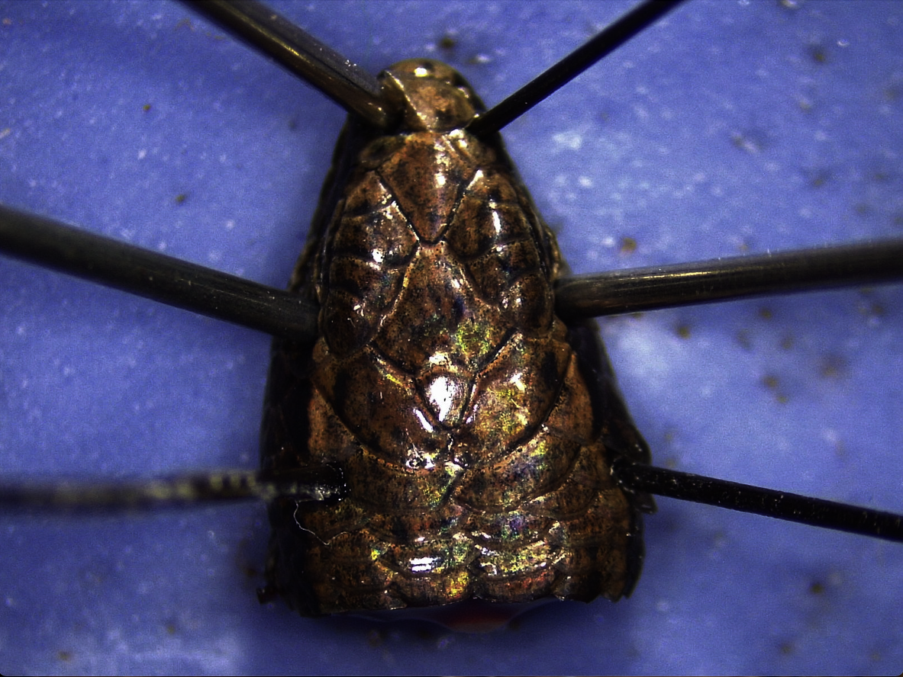
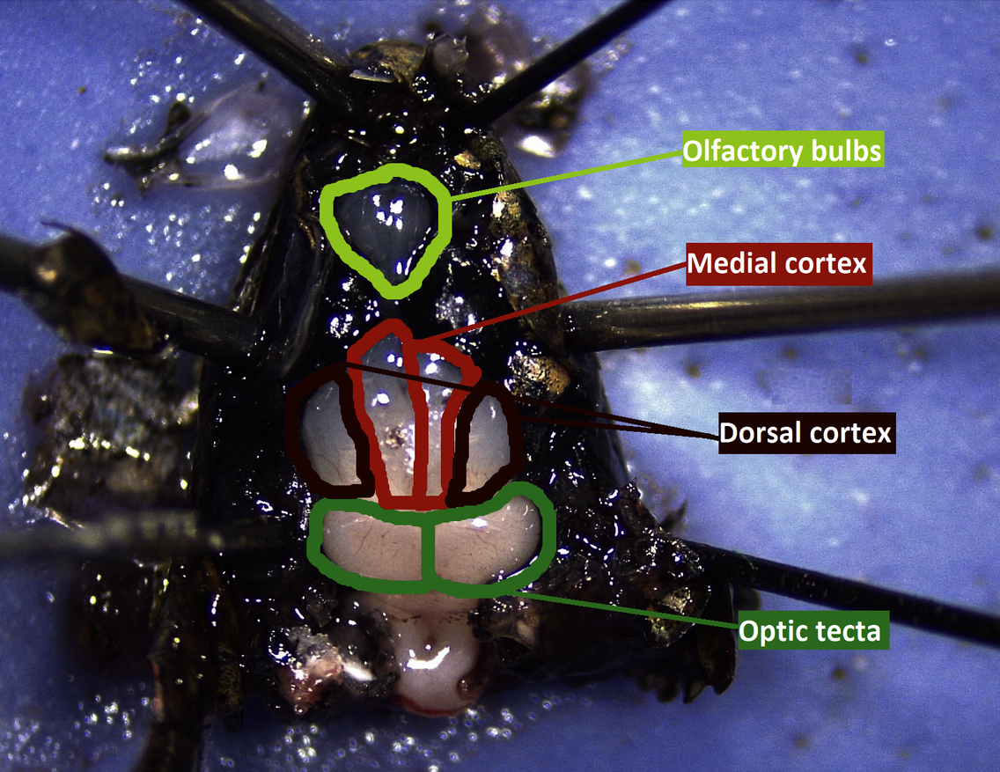
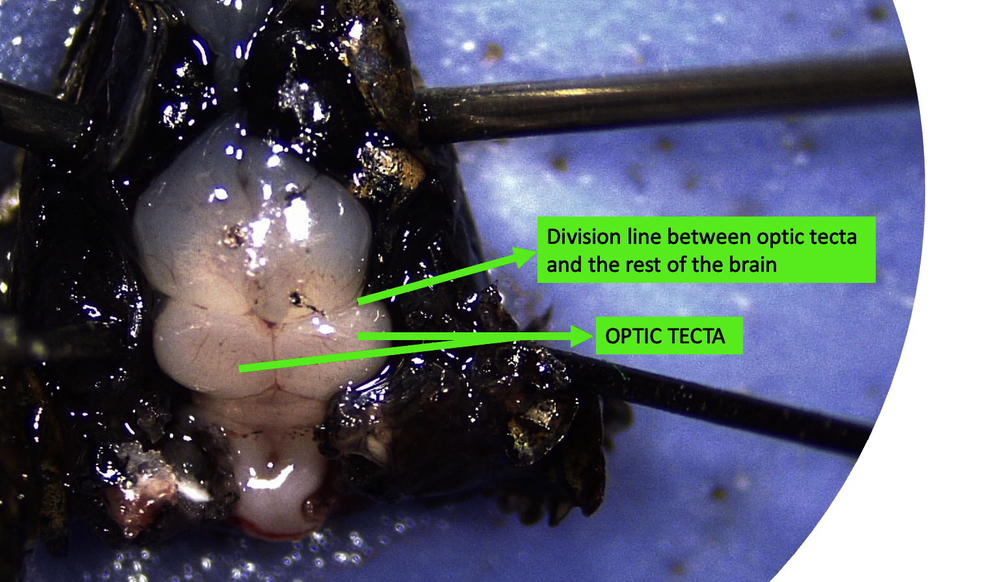
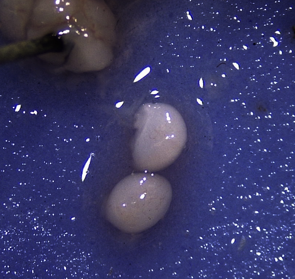
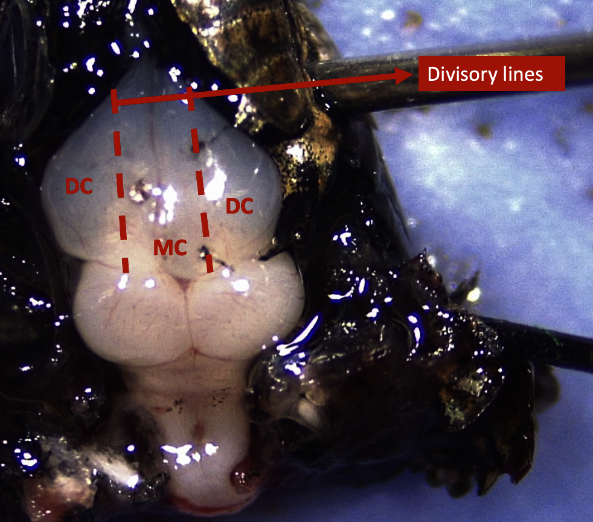
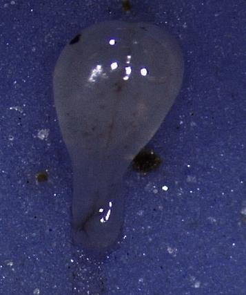

```{r setup, include=FALSE}
knitr::opts_chunk$set(results = 'asis' , eval = TRUE)
options(digits=2)
```

## *Euthanasia*

  1) Pick more than 1cc of Sodium pentobarbital (in 'tool kit')
  2) Pick the lizard
  3) Inject 1cc of Sodium pentobarbital intraperoneally
  4) Wait a few seconds unbtil the lizard stops moving, then flip the lizards or pinch the toes and see the response, no response means is dead
  5) *Always collect the identity of the lizard and write it down in the database*


## *Dissection material*

  * Scissors  
  * Dissection scope  
  * Silicone pad  
  * Tweezers (see size)  
  * Dissection pins  
  * 2 Tweezers (see size)  
  * Scapel  
  * Blades  
  * Dissection scissors  
  * Spatule  
  
## *Procedure*
  1) **Cut the head of the lizard after the ears**
  2) **Pin the lizard** (see Fig 1):  
    - Avoid the skull by pinching on nostrils, eyes and "cheeks" (before the tympanic membrane)  
    - Pins inclined to avoid movement (like with tents)  

<center> {height="300px" width="400px"}  

</center>

  3) **Peel** CAREFULLY the skin and black membrane with the thin tweezers until full brain is visible (Fig 2)  

<center> {height="300px" width="400px"}  

</center>

  4) **Extract optic tecta** (see Fig 2):  
    - Cut first with the scalpel along the separation axis between optic tecta and the rest of the brain (Fig 3); the scalpel can be move from onwards to backwards, never side to side  
    - After soing that, cut carefully from front to back to extract the optic tecta (Fig 4); help yourself with spatule if needed  

<center> {height="300px" width="450px"}  

{height="300px" width="400px"}  
</center>

  5) **Extract dorsal cortex** (see Fig 2):  
    - Make a small incision in one of the lines that divides medial and dorsal cortex, indicated by a change of shape (Fig 5). The scalpel must go just down (do not move)  
    - Put the scalpel in horizontal and extract the layer; help yourself with spatule if needed  
    - If lateral cortex comes with the dorsal cortex, get rid of it by cutting it  
    - Repeat the process with the dorsal cortex in the other side of the brain  

<center> {height="300px" width="400px"}  

</center>

  6) **Extract medial cortex** (see Fig 2):  
    - Cut the olfactory tracts if not broken before with peeling
    - With the thin tweezers or the dissection scissors, separate medial cortex from subcortical tissue

  7) **Extract olfactory bulbs** (see Fig 2):  
    - Take the dissection scissors to cut all the fibers that link the olfactory bulbs to vomeronasal system and the rest of the cavity  
    - With the help of a spatule, extract the bulbs (Fig 6) from the bottom

<center> {height="200px" width="200px"}  

</center>

