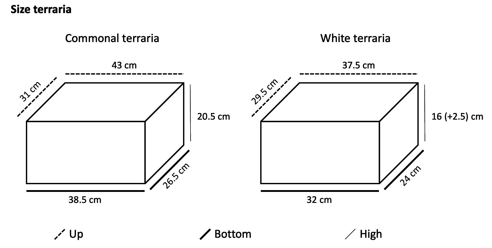

```{r setup, include=FALSE}
knitr::opts_chunk$set(results = 'asis' , eval = TRUE)
options(digits=2)
```

### **(Early) Environment manipulation**

<details>
  <summary style=font-size:16px>*Eggs incubation*</summary>

* Containers - <span style="color: blue"> Where to find them </span>  
* Vermiculite or similar - <span style="color: blue;"> What and where to find it </span>  
<span style+"color: darkgreen">
  + Both vermiculite and containers are in Wes Withen lab, in the incubators room
</span>
</details>

<details>
  <summary style=font-size:16px>*CORT supplementation*</summary>
  
* CORT - <span style="color: blue;"> Where to find it </span>  
* Vehicle - <span style="color: blue;"> What and where to find it </span>  
* Pippetes or similar to apply solution - <span style="color: blue;"> What and where to find them </span>  
* Gloves - <span style="color: blue;"> Where to find them </span>  
<span style+"color: darkgreen">
  + All material found in Wes Withen
</span>
</details>

<details>
  <summary style=font-size:16px>*Eggs incubation*</summary>
  
* Incubators - <span style="color: blue;"> How to use them </span>  

</details>

### **Learning tasks**
<details>
  <summary style=font-size:16px>*Spatial learning task*</summary>
  
* Terraria - <span style="color: blue;"> How many do we need? Size? Should we by more? How many? </span>  
<Span style="color: darkgreen;">
  + We may need 100 terraria:  
  {height="250px" width="400px"}
</span>
* Cameras	- <span style="color: blue;"> How many do we need? Should we by more? How many? **Where can we place them?** </span>  
<span style="color: darkgreen;">  
  + Each camera covers 4 terraria, we need 20 approx 	
  + There are 12 cameras already, we **buy 8 more (2 CCTV systems)*  
  + CCTV systems can be placed in incubators' room
</span>
* Shelters - <span style="color: blue;"> Would it be OK if we use glasses for the central shelter? </span>  
* Brush to chase them - <span style="color: blue;"> Do we have one? Where to find it </span>		
<span style="color: darkgreen">
  + Buy one  
</span>
</details>

<details>
  <summary style=font-size:16px>*Visual-reversal learning task*</summary>

* Terraria and cameras (Same as in Spatial learning task)  
* Feeders	- <span style="color: blue;"> How many do we need? How to build them/do we have? Where? </span>  
<span style="color: darkgreen">
  + There are painted blocks somewhere in the lab (search them), we may need more and a third colour  
</span>
* Cardboard/material painted - <span style="color: blue;"> Decide what is better. Ask for spectophotometer if needed </span>   
* Prey (reward) - <span style="color: blue;"> How many? Should we use live prey, like crickets, or canned prey (prey in cue perception tests)? </span>  
<Span style="color: darkgreen;"> 
  + We may need 3 per ind per trial, one of them being consumed = 5300 approx  
  + Better use live prey - **Mealworms** instead of crickets
</span>

</details>

### **Other cognitive tests**
<details>
  <summary style=font-size:16px>*Cue perception*</summary>

* Terraria and cameras (Same as in Spatial learning task)  
* Containers - <span style="color: blue;"> What to use? How many do we need? Where to find them? </span>	 
<span style="color: darkgreen">
  + Plastic glass or similar	2 per individual = 200 approx
  + Filter paper	
</span>
* Prey - <span style="color: blue;"> Canned food or live prey? How many needed? </span>
<span style="color: darkgreen">
  + 3 types of prey per ind = 100 preys/type  
  + List of canned food available (Lab in Robertson Building 3rd green drawer under the table in the middle of the room):  
    - Snails [6 cans]  
    - XL crickets [1 can]  
    - Grasshoppers [1 can]  
    - XL Grasshoppers [1 can]  
    - Fish [3 cans]  
    - Silkworms [1 can]  
    - Shrimps [1 can]  
    - Artemia [1 can]  
    - Mealworms [3 cans]  
</span> 

</details>

<details>
  <summary style=font-size:16px>*Numerical abilities*</summary>

* Terraria and cameras (Same as in Spatial learning task)  
* "Prey" - <span style="color: blue"> Could we use a kind of porridge made of flour and crickets or similar and shaped into small balls? That way we would be able to control continuous variables (volue, area, etc)
</span>
<span style="color: darkgreen">
  + Porridge balls can work, but they need to be trained first  
</span>
</details>

<details>
  <summary style=font-size:16px>*Personality*</summary>

* Terraria and cameras (Same as in Spatial learning task)  
* Refuges for *boldness antipredatory* trials - <span style="color: blue"> Where to find:
  + Shelters (What to use)
  + Ice for "cold" refuge
</span>
* Objects for *neophobia/neophilia* trials :
<span style="color: darkgreen">
  + List of objects (in Robertson building lab, 2nd grey drawer between the fridges):
    - Orange earplugs - 2cm lenght
    - Dice with pink glue square - 1.8cm side approx
    - Red (3cm length), yellow (5cm), and/or white (6.7cm) plastic pin-like objects
    - Transparent marbles (1-1.5cm diameter) with red, blue and yellow feathers inside
    - Yellow and pink plasteline
  </span>
* Filter paper, double-sided tape, sand or similar, cardboard or similar (FOR WALLS?) - <span style="color: blue"> Where to find all. Buy more? </span>
</details>

### **HPA axis response**
<details>
  <summary style=font-size:16px>*-*</summary>


</details>

### **Brain analyses**
<details>
  <summary style=font-size:16px>*Dissection material*</summary>

  * Scissors <span style="color: green"> V </span>  
  * Dissection scope <span style="color: red"> Get one to Wes Withen (for now) </span>  
  * Silicone pad <span style="color: green"> V </span>  
  * Tweezers (see size) <span style="color: green"> V </span>  
  * Dissection pins <span style="color: red"> Buy </span>  
  * 2 Tweezers (see size) <span style="color: red"> Buy one more </span>  
  * Scapel <span style="color: green"> V </span>   
  * Blades <span style="color: red"> Buy more on the internet </span>   
  * Dissection scissors <span style="color: green"> V </span>   
  * Spatule <span style="color: red"> Buy one </span>  

</details>

<details>
  <summary style=font-size:16px>*_*</summary>


</details>


