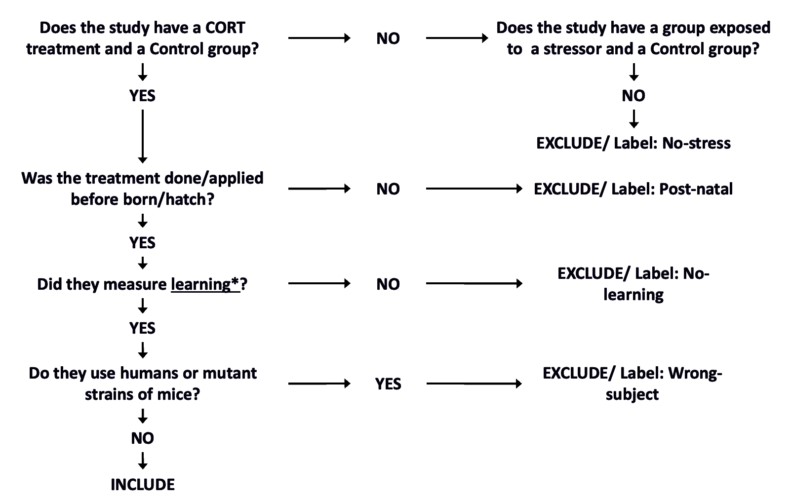

### **Objectives and main question**

 The main objective of the meta-analysis is to examine how elevation of GCs during embryonic development affects learning abilities: **Does prenatal exposure to GCs affect learning?**  
To do so, I need to identify studies that conducted some GCs-related manipulation on dams or eggs before hatchling and then measured learning abilities. More specifically, I will use studies testing the differences in learning performance of offspring coming from dams or eggs treated with GCs or submitted to any kind of stressor versus a control group.  

In addition, I will also aim to test the influence of incubation temperature on prenatal GCs effects: **Does the incubation temperature influence the effect of GCs-related treatment?**  
For that - if the amount of studies is enough -, I will examine the impact of early thermal environment by employing only those studies that include the incubation temperature of eggs and investigating the relationship between temperature and GCs’ effect. 
  

### **Search terms**

* Searchs made during 2022 in *Web of Science* and *Scopus*  
* Initial terms obtained from Eyck et al. 2019 (*Biol Rev*), and Lambert & Guillete 2021 (*Biol Rev*):  
  + developmental, early-life, pre-natal/hatch  
  + stress, maternal separation, handling, restrain, restriction, dessication, predator, hast hardening, nutrition, exposure, CORT, Glucocorticoids, Corticosterone  
  + cognition, learning, memory  

* Code for *Web of Science*:  

  
*Trial 1*
  
  
  - CODE: (development* OR early-life OR early life OR pre-natal* OR pre natal* pre-hatch* OR pre hatch* ) AND (stress* OR maternal separation OR handl* OR restr* OR dessicat* OR predat* OR nutrit* OR  expos* OR Glucocorticoid* OR Cort* ) AND (cognit* OR learn* OR memory) NOT (human* OR child* OR infant*)  
  - RESULTS: **55,602** papers  

  

  
*Trial 2*
  
  
  - CODE: (eggs OR mother OR maternal OR early-life OR early life OR pre-natal* OR pre natal* OR pre-hatch* OR pre hatch* ) AND (stress* OR Glucocorticoid* OR Cort* ) AND (cognit* OR learn* OR memory) NOT (human* OR child* OR infant* OR therapy OR trauma* OR emotion* OR clinic* OR plant*)   
  - RESULTS: **3,214** papers  

  

* Code for *Scopus*:  

  
*Trial 1*
  
  
  - CODE:  
    Search 1: TITLE-ABS-KEY(eggs OR mother OR maternal OR early-life OR "early life" OR pre-natal* OR "pre natal* " OR pre-hatch* OR "pre hatch* " AND NOT (human* OR child* OR infant* OR therapy OR trauma* OR emotion* OR clinic* OR plant*))  
    Search 2: TITLE-ABS-KEY(stress* OR Glucocorticoid* OR Cort* AND NOT (human* OR child* OR infant* OR therapy OR trauma* OR emotion* OR clinic* OR plant*))  
    Search 3: TITLE-ABS-KEY(cognit* OR learn* OR memory AND NOT (human* OR child* OR infant* OR therapy OR trauma* OR emotion* OR clinic* OR plant*))  
    Finally, I combined all the searches (Search > Search history > Combine queries) 
  - RESULTS: **1,528** papers  

  

  * *Other searches*:  
  Together with the search on both databases, I search those papers in the metadata from Eyck et al. 2019 (*Biol Rev*) where learning or cognition was measured as the main trait (**12** papers)
  

### **Papers downloaded and duplicated studies**

  * After obtaining all the references, I created a library on EndNote 20 (*Meta-analysis.enl*), combined all the references in one list and got rid of duplicates (Library>Find Duplicates).  
  Total number of duplicates: 931  
    - RESULTS: **4,288** papers  

### **Rayyan process**

  
 Importing a library from NoteEnd and preliminary screening 
  

  1. Export file from EndNote selecting **Output style 'Refman (RIS) Export'**  
  2. Import to RAYYAN by using command **Select files**  
  3. Then, use the decision tree (see 'Selection criteria' in 'Screening papers section') to screen through at least 100 papers to see how many can be included  
    - RESULTS: **8 included/112 screened**
 

  

  
 Sharing the RAYYAN library with collaborators 
  

  1. In 'My Reviews', select the review to sher and click on **'Invite'**. Then Select Type: **'Collaborator'** and write the emails of collaborators.
 

  
 Screening papers 
  

* Selection criteria: 
  
* Concepts in decision tree:  
  + **Definitions and examples of CORT and stressors:**
    - Other synonyms of CORT are Corticosterone, Cortisol, Glucocorticoids (GCs)  
    - Some procedures considered stressors in rats: learned helplessness, the forced swimming test, the tail suspension test, isolation, chronic mild stress, and sleep deprivation  
    - We will consider a stressor anything else that is stated as a stressor directly by the authors  
    - If there is a treatment but we do not know if it can be stressful or not, then is a "Don't know" (see decision tree)  
  + **Definitions and examples of learning:**  
    - Memory or cognition can be used as synonyms  
    - Spatial or associative tasks can be synonyms of learning  
    - ALso, another learning test usually used with rats is the Morris-water task/water task  
  + **What is a "mutant strain" of mice/rats?**  
    - In some papers, they use laboratory reared strains of mice or rats that may be more sensitive to CORT or the stressor used; unless they also use a 'wild-type' mice, we will exclude those papers  

  
 FINAL RESULTS 
  
  
 

### **How to extract effect size**

### **Analyses**

